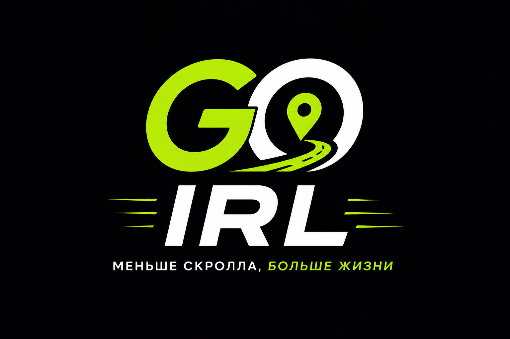

# GO IRL Telegram Mini App



Before contributing or implementing new features, read:

0. [DOCS_INDEX.md](DOCS_INDEX.md)
1. [docs/PRODUCT_PHILOSOPHY.md](docs/PRODUCT_PHILOSOPHY.md)
2. [docs/GO_IRL_CONSTITUTION.md](docs/GO_IRL_CONSTITUTION.md)
3. [docs/MARKET_POSITIONING.md](docs/MARKET_POSITIONING.md)
4. [docs/COMPETITOR_WATCH.md](docs/COMPETITOR_WATCH.md)
5. [docs/SPORT_COACH_MVP.md](docs/SPORT_COACH_MVP.md)
6. [docs/COACH_CHAT_TRUST_LAYER.md](docs/COACH_CHAT_TRUST_LAYER.md)

Every major product or architecture decision must support the mission:

**Less scrolling. More living.**

If a feature increases screen time but does not increase real-life meetings, it should be reconsidered.

GO IRL (Go In Real Life) is a Telegram Mini App for creating and joining offline activities, starting with Olomouc.

All major product and architecture decisions must follow the [GO IRL Constitution](docs/GO_IRL_CONSTITUTION.md).

## Current Product Focus

Closed beta focuses on Olomouc and the real-life event loop:

create event -> share -> participants join -> event chat -> people show up in real life.

For version 1.1, **Coach means Sport Coach only**. Coach is not a universal helper for all events. Guides, language buddies, game masters, hosts, referees, and paid role marketplaces are future Event Roles work after the Sport Coach MVP proves value.

The Coach/Role + Chat trust layer is documented separately. Its purpose is to place event support and temporary event chat close together so users trust the event enough to attend. Generic usage is a temporary bridge only; it must not redefine Coach as a universal role.

## Current Stack

- React, TypeScript, Vite
- Zustand for client state
- Supabase for activities, participants, private join requests, and realtime updates
- Telegram WebApp bootstrap with trusted `initData` verification through Supabase Edge Functions
- Telegram Mini App lifecycle helpers for ready, expand, back, and explicit close actions
- Dark mobile-first UI with safe-area aware header
- Brand assets in `public/brand/`

## Setup

```powershell
pnpm install
pnpm run dev
```

Create `.env.local` from `.env.example` and fill:

```text
VITE_SUPABASE_URL=
VITE_SUPABASE_PUBLISHABLE_KEY=
VITE_TELEGRAM_BOT_USERNAME=GOirl_bot
VITE_GO_IRL_ADMIN_KEYS=telegram:123456789,telegram_username:yourusername
# Optional local-only compatibility mode. Never enable for public production.
VITE_GO_IRL_LEGACY_DEMO_AUTH=false
```

Security note: `VITE_GO_IRL_ADMIN_KEYS` is DEV/DEMO ONLY. Every `VITE_*` value is bundled into public frontend JavaScript. Do not put real production admin identifiers there.

Trusted auth note: production auth uses `Telegram.WebApp.initData` -> `verifyTelegramInitData` Supabase Edge Function -> verified JWT -> Supabase RLS. The old `x-go-irl-user-key` model is now legacy demo mode only and must stay disabled in public production.

After starting Vite, open the local URL shown in the terminal. For Telegram testing, the deployed Mini App URL is configured in BotFather.

## Telegram Mini App constraints

Current runtime target is Telegram Mini App first, browser demo second.

Boundaries for MVP 1.1:

- Production identity comes from Telegram `WebApp.initData`, verified through the Supabase Edge Function `verifyTelegramInitData`.
- `initDataUnsafe` and browser fallback identity are not trusted production auth.
- The Mini App may call Telegram lifecycle helpers such as `ready`, `expand`, Back Button handling, and explicit close.
- The app must not close unexpectedly. Closing the Mini App must be user-triggered through explicit Done / Back to Telegram actions.
- The Mini App must not rely on background polling or hidden background work.
- Browser mode without Telegram `initData` uses local demo state and must not be treated as verified Telegram identity.
- Browser demo writes are allowed locally, but must not touch production Supabase.
- Any feature that needs production writes must pass trusted auth or stay in demo/local-only behavior.

## Share / Join flow boundary

Sharing is part of the main MVP loop: create event -> share -> join -> chat -> real attendance.

Current MVP boundary:

- Primary share target is Telegram.
- Event share links should use Telegram Mini App `startapp` deep links:

```text
https://t.me/[BOT_USERNAME]/[APP_NAME]?startapp=[ACTIVITY_ID]
```

- Browser fallback uses `/join/:id` to open the target activity in the web app.
- `/join/:id` is a landing/opening route, not a separate event website or ticketing page.
- iOS must not redirect users to the App Store as a substitute for opening the Telegram Mini App.
- Open Graph metadata should describe the shared event and use an absolute image URL.
- Share text must not be reused for unrelated flows such as bug reporting.
- Joining still follows normal visibility and capacity rules:
  - public event: direct join when capacity is available;
  - invite/private event: request or organizer approval where required;
  - full event: waiting state where supported.

Implementation-sensitive notes:

- Verify share behavior against the current share helper and route handling before changing copy or URL shape.
- Do not introduce App Store redirects, paid ticketing, tracking pixels, or external landing infrastructure during MVP stabilization.

## Verification

```powershell
pnpm run test
pnpm run lint
pnpm run build
```

The build command runs `tsc -b` and then creates the production Vite bundle.

## Implemented

- Universal `Activity` model
- Public and private activities
- Organizer edit flow
- Private join requests with approve/reject actions
- Participants list with joined, waiting, and pending states
- Activity creation with category, activity type, address, and optional location URL
- Browser demo mode with Olomouc demo events and local-only writes outside Telegram
- Save Activity to Google Calendar through a template link without Google OAuth
- Share link that opens the Telegram Mini App with `startapp`
- Browser `/join/:id` fallback opens the target activity
- City selection architecture with Olomouc as the first city
- City expansion with Praha/Prague available through configuration
- Russian, Ukrainian, Czech, and English localization architecture
- Sprint 1 temporary admin allowlist for organizer/admin event deletion
- Safe-area aware fixed header for Telegram Mini App
- Explicit "Done" / "Back to Telegram" UX; the Mini App closes only after a user action
- Sport Vertical MVP with sport-specific card, details, create fields, and matching engine
- Sport Coach MVP 1.1 product scope: Coach is sport-only; future roles move to Event Roles
- Coach/Role + Chat trust layer documented as the conversion pattern that keeps event support close to temporary event chat
- ActivityRendererRegistry with Sport and Generic registrations for future vertical expansion
- GO IRL brand logo, favicon, app icon, and Open Graph preview
- Supabase schema and RLS policies in `supabase/schema.sql`
- Supabase Edge Function `verifyTelegramInitData` for Telegram HMAC verification and trusted session issuing
- Supabase setup guide in `supabase/README.md`
- ESLint and Vitest quality gates
- Netlify build configuration in `netlify.toml` is historical/secondary; Vercel is the current beta deployment target.
- Vercel fallback deployment configuration in `vercel.json`

## Project Documents

- `DOCS_INDEX.md` - documentation status registry and source-of-truth map
- `docs/MVP_DOC_AUDIT.md` - MVP documentation conflict registry
- `docs/MISSING_SECTIONS.md` - missing documentation boundary registry
- `docs/audit/KNOWLEDGE_DEBT.md` - active knowledge debt registry
- `docs/PRODUCT_PHILOSOPHY.md` - product manifesto and mission
- `docs/GO_IRL_CONSTITUTION.md` - product and architecture source of truth
- `docs/MARKET_POSITIONING.md` - market positioning source of truth and MVP feature filter
- `docs/COMPETITOR_WATCH.md` - competitor watchlist and product monitoring rules
- `docs/SPORT_COACH_MVP.md` - Sport Coach MVP 1.1 scope, beta metrics, roadmap, and Event Roles guardrails
- `docs/COACH_CHAT_TRUST_LAYER.md` - trust layer concept for keeping role/helper support next to Activity Chat
- `CHANGELOG.md` - shipped changes
- `ROADMAP.md` - product and engineering direction
- `docs/roadmap/SPRINTS.md` - sprint-by-sprint delivery plan
- `docs/roadmap/SPRINT_0.md` - historical Sprint 0 record, not current deployment source of truth
- `BACKLOG.md` - confirmed work queue
- `RELEASE_NOTES.md` - release-ready notes for deployment
- `DEPLOYMENT.md` - production deployment and smoke-test checklist
- `supabase/README.md` - Supabase setup, migration, RLS, env, and verification guide
- `docs/Database.md` - target database architecture for users, interests, discovery, digest, and optional activity chat
- `docs/vertical-experiences.md` - vertical modules architecture for sport, dating, friends, food, and generic fallback
- `docs/performance.md` - code splitting, bundle strategy, and vertical loading rules
- `docs/AI.md` - AI platform, discovery, normalization, duplicate detection, and privacy guardrails
- `docs/ai-event-discovery.md` - AI event discovery pipeline plan
- `docs/Notifications.md` - notification preferences, evening digest, and chat notification rules
- `docs/n8n-workflows.md` - future n8n workflow architecture
- `docs/privacy.md` - privacy-first product architecture
- `docs/Security.md` - RLS, permissions, token, abuse, and audit strategy
- `docs/RLS.md` - table-by-table Supabase RLS design
- `docs/Admin.md` - admin roles, permissions, and future admin surfaces
- `docs/Moderation.md` - report, block, moderation hold, and audit architecture
- `docs/RecommendationEngine.md` - recommendation engine v2 architecture
- `docs/reputation.md` - RLI, Trust Score, Community Contribution, attendance confirmation, and reputation privacy
- `docs/EventLifecycle.md` - Activity lifecycle from creation to archive
- `docs/UserLifecycle.md` - user lifecycle from registration to deletion

<!-- GO_IRL_STABILIZATION_LINKS -->
## MVP stabilization

- [MVP stabilization plan](docs/MVP_STABILIZATION_PLAN.md)
- [Development protocol](docs/DEVELOPMENT_PROTOCOL.md)

Run a local health audit:

```bash
node scripts/go-irl-health-audit.cjs
```

## Current stabilization status

Date: 2026-07-08

Current closed/patched areas:

- Browser Mock Mode
  - Browser without Telegram `initData` uses local demo state.
  - Demo writes are local-only and must not touch production Supabase.
- Restore Coach + Chat
  - Coach and Event Chat panels are mounted in sport event details.
  - Coach/Role + Chat is now documented as a trust layer; any generic usage is a temporary bridge until Event Roles exist.
- Event Card Time Fix
  - Sport cards show event start time consistently.
  - Empty time badge is not rendered.
- Profile Fix
  - Profile edit uses Save and local persistence.
  - Demo avatar upload stores a local data URL.
  - Production Supabase Storage avatar upload is still pending a separate Storage/RLS-safe task.
- Bug Report Fix
  - Bug report opens Telegram support link and does not copy share text.
- Weather Widget
  - Sport event details use Open-Meteo weather without API keys.
- Share Fix
  - Share links use Telegram Mini App `startapp` deep links.
  - Browser `/join/:id` opens the target activity.
  - Open Graph metadata is present with an absolute image URL.
- Beta UI Cleanup
  - Static `BETA` dev marker and debug panel were removed from `index.html`.

Verification status:

- Vercel: latest checked commits are deploying/building through Vercel status checks.
- Local `pnpm run lint`: pending after latest commits.
- Local `pnpm run build`: pending after latest commits.
- Local `pnpm run test`: pending after latest commits.

Do not claim beta-ready until local quality gates pass on the latest `main`.
