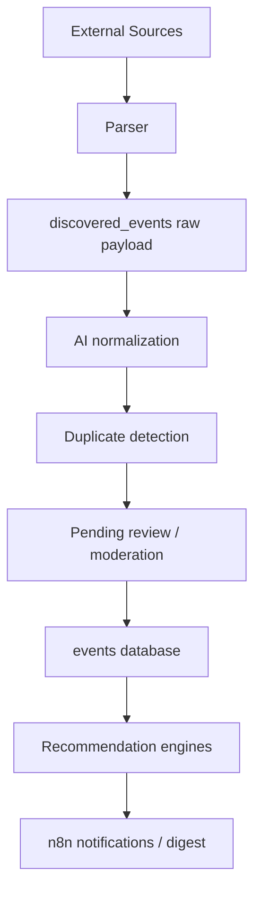

# AI Architecture

GO IRL uses AI as a platform helper, not as the owner of business logic.

AI must support real-life meetings, respect privacy, and stay replaceable behind clear interfaces.

## Scope

Allowed future AI responsibilities:

- external event discovery support
- event normalization
- duplicate detection
- recommendation ranking
- moderation support
- event and digest summaries

Not allowed:

- hidden background tracking
- using private chat contents without explicit consent
- sending Telegram ID, phone, email, or private profile details to AI APIs
- making final safety decisions without human/moderation override

## AI Event Discovery Pipeline

## Sources

MVP-safe sources:

- public event websites
- RSS feeds
- official APIs
- public Telegram channels
- public calendars
- manual moderator-added sources
- user-submitted suggestions

Facebook Groups are future-only through official API or manual review. Do not automate a personal Facebook account. Do not store Facebook credentials.

## Normalization

AI normalizes:

- title
- description
- category
- activity type
- city
- location
- start/end time
- price
- source URL
- confidence score

## Duplicate Detection

Duplicate checks use:

- source URL
- source record ID
- normalized title
- city
- venue/location
- start time
- semantic similarity

## Moderation

AI can mark candidates as:

- accepted
- rejected
- duplicate
- needs_review

Human/moderator review is required for low-confidence, risky, or unclear items.

## Privacy Guardrails

- Use public event data where possible.
- Use anonymized interests for recommendations.
- Do not send raw private profile data.
- Do not send chat content without explicit consent.
- Store AI logs without excessive personal data.

## Implementation Status

This is architecture only. No real AI API, parser, or workflow JSON is implemented in the Mini App runtime.
