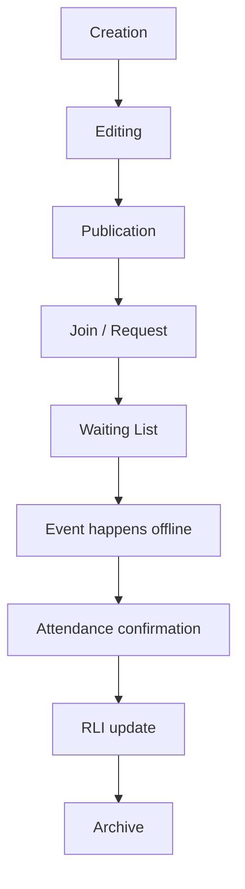

# Event Lifecycle

This document defines the target Activity/Event lifecycle.

## Lifecycle



## Creation

Organizer creates an Activity with:

- title
- description
- category/activity type
- city
- place
- date/time
- price
- capacity
- visibility
- optional participant note
- optional vertical metadata

## Editing

Only organizer or admin can edit.

Changes should preserve:

- participants
- join requests
- visibility rules
- city/activity metadata

## Publication

Published Activities become discoverable according to visibility:

- public
- invite
- private

## Join / Request

- Public: confirmed join if capacity is available.
- Invite: pending request until organizer approval.
- Private: no direct join unless organizer grants access.

## Waiting List

When full, users can enter waiting state where supported.

## Activity Chat MVP boundary

Activity Chat exists only to coordinate a real-life event.

Current MVP boundary:

- Chat is tied to one Activity.
- Chat is only useful after a user has joined or is otherwise allowed to participate.
- Chat is not a general messenger.
- Chat must not become a feed, channel, stories surface, or engagement loop.
- Chat should support simple coordination: arrival, place, time, equipment, quick questions.
- Advanced moderation, reactions, stickers, channels, media-heavy messaging, and notification automation are future scope unless explicitly added to the current roadmap.

Implementation-sensitive notes:

- Current runtime behavior must be verified against `src/components/ActivityChatPanel.tsx`, `src/activityChatFeature.ts`, and Supabase chat migrations before changing this lifecycle.
- Do not change chat RLS, auth, retention SQL, or cleanup jobs from documentation cleanup work.
- Any change to chat access, expiry, or retention requires explicit product and Supabase approval.

## Chat 24-hour limit

The product intention is temporary event coordination.

Current documentation boundary:

- Chat should not be presented as permanent messaging.
- Chat should be treated as temporary and archived/closed around the event lifecycle.
- Existing docs previously stated that Activity Chat archives by default 24 hours after event end.
- Existing migration/runtime behavior must be audited before claiming the final production rule, because implementation may differ from the target lifecycle wording.

Until the audit is complete, use this safe wording:

```text
Activity Chat is temporary. The exact close/archive timing must be verified against the current Supabase migration and runtime code before release.
```

Do not claim a final 24-hour rule in UI or public release docs until code and database behavior match the documented lifecycle.

## Offline Event

The real meeting is the product goal.

## Confirmation

Initial approach:

- organizer confirms participants
- participants can confirm each other
- majority confirmation can mark event completed

No QR codes at the start.

## RLI

RLI increases for real participation, organizing, and community help. It decreases for no-show, spam, fake events, and confirmed reports.

## Archive

Past events are archived after lifecycle processing.

Activity Chat, if enabled, is temporary and should be closed/archived according to the verified chat lifecycle. The final archive timing must be synchronized with current Supabase migrations and runtime code before release.
