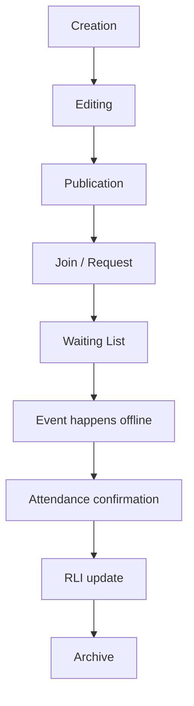

# Event Lifecycle

This document defines the target Activity/Event lifecycle.

## Lifecycle

## Creation

Organizer creates an Activity with:

- title
- description
- category/activity type
- city
- place
- date/time
- price
- capacity
- visibility
- optional participant note
- optional vertical metadata

## Editing

Only organizer or admin can edit.

Changes should preserve:

- participants
- join requests
- visibility rules
- city/activity metadata

## Publication

Published Activities become discoverable according to visibility:

- public
- invite
- private

## Join / Request

- Public: confirmed join if capacity is available.
- Invite: pending request until organizer approval.
- Private: no direct join unless organizer grants access.

## Waiting List

When full, users can enter waiting state where supported.

## Offline Event

The real meeting is the product goal.

## Confirmation

Initial approach:

- organizer confirms participants
- participants can confirm each other
- majority confirmation can mark event completed

No QR codes at the start.

## RLI

RLI increases for real participation, organizing, and community help. It decreases for no-show, spam, fake events, and confirmed reports.

## Archive

Past events are archived after lifecycle processing. Activity Chat, if enabled, archives by default 24 hours after event end.
