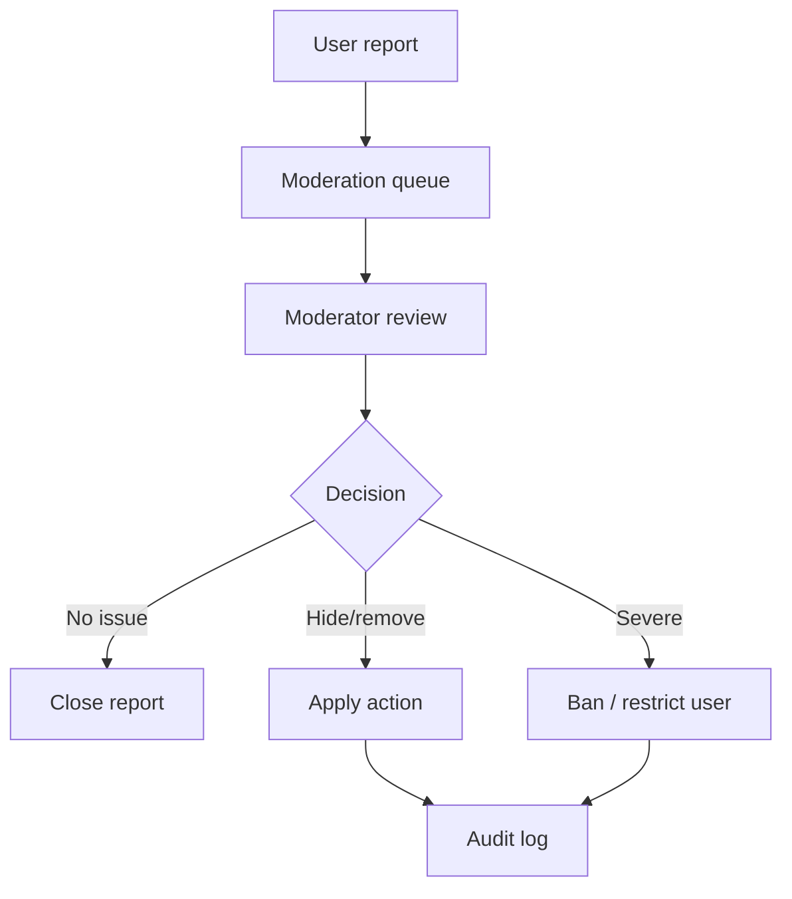

# Moderation Architecture

Moderation protects users, organizers, and local communities without turning GO IRL into a surveillance product.

## Moderation Objects

Future moderation can apply to:

- users
- activities
- join requests
- activity chat messages
- external sources
- discovered events
- reports

## Report Flow

## Actions

Possible actions:

- hide event
- cancel event
- remove chat message
- archive chat
- warn user
- mute user
- block user
- ban user
- place moderation hold

## Moderation Hold

Moderation hold can prevent automatic cleanup:

- reported Activity Chat is not archived/deleted by n8n cleanup until reviewed.
- relevant audit metadata is retained for a limited period.
- normal users should not see hidden content while review is active.

## Privacy Rules

- Keep only necessary evidence.
- Do not expose reporter identity publicly.
- Do not log excessive personal data.
- Do not send private moderation payloads to AI without explicit policy.

## Not Implemented Now

This is a design document only. No moderation runtime UI or API is added.
