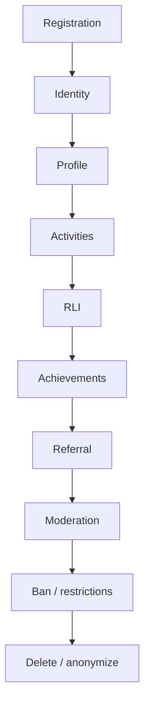

# User Lifecycle

This document defines the target user lifecycle.

## Lifecycle

## Registration

Initial identity comes from Telegram Mini App context or guest fallback for local testing.

Production identity must use trusted Telegram `initData` validation or backend-issued session.

## Identity

Identity data should be minimized:

- app user ID
- provider mapping hash
- city
- language
- status

Do not expose Telegram ID publicly.

## Profile

Profile includes:

- display name or pseudonym
- avatar code
- city
- bio
- interests
- privacy settings later

## Activities

User can:

- create
- join
- request
- leave
- organize
- receive notifications

## RLI

Real Life Index reflects real-world participation and trust signals, not likes or currency.

## Achievements

Achievements should support real-life behavior, not addictive loops.

## Referral

Referral rewards only after meaningful confirmed participation, not empty signups.

## Moderation

Reports, blocks, restrictions, and warnings must be available before risky verticals scale.

## Ban / Restrictions

Blocked or banned users lose access according to safety policy and RLS/backend enforcement.

## Delete / Anonymize

Future account deletion must:

- delete/anonymize profile
- remove notification preferences
- anonymize old participation where needed
- remove or archive chat data according to retention policy
- preserve minimal audit records when legally/safety-required
